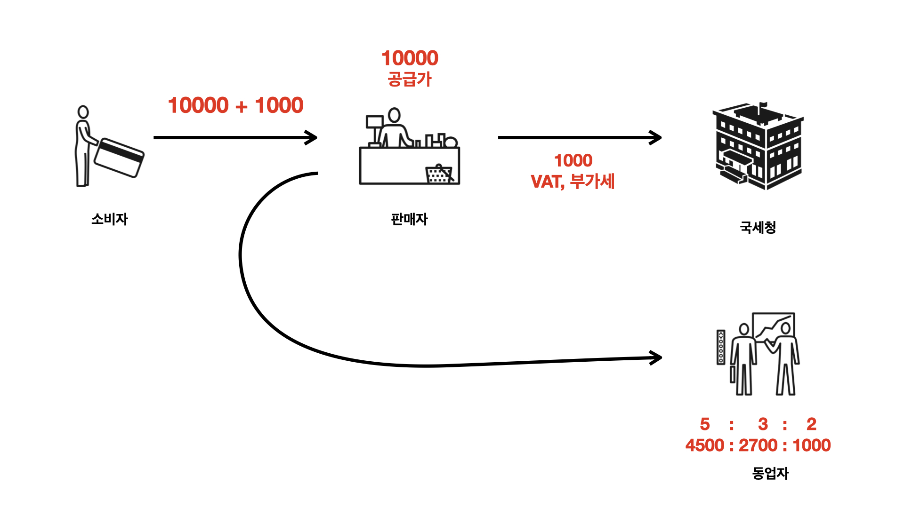

# 자바 핵

## 자바 및 개발환경설치
검색어 : download java sdk, download eclipse

## 자바실행
Hello World를 화면에 출력해봅니다.
  
[HelloWorld.java](src/HelloWorld.java)

## 자바의 동작원리
원인과 결과를 이해합니다.  
  
실행과 컴파일의 과정을 이해합니다.  
  


## 자바로 할 수 있는 일들

### 데스크탑 앱

[프로젝트 : HelloWorldGUIApp.java](src/HelloWorldGUIApp.java)  

[동영상](https://opentutorials.org/course/3930/26654)


### 사물인터넷 

[동영상](https://opentutorials.org/course/3930/26655)

### 웹애플리케이션

[코드](https://gist.github.com/egoing/0a919424cc49a457bc195ad3a06e5a9e)

### 안드로이드 

[동영상](https://opentutorials.org/course/3930/26656)

## 프로젝트 소개
거래를 기록하고 계산해주는 앱을 만들고 싶습니다.  
핵심 계산식을 만들어봅니다.  
이것에 여러가지 기능을 붙여가면서 고도로 복잡한 앱이 만들어지는 과정을 살펴볼 것입니다.  

  

[프로젝트 : Account.java](src/Account.java)

## 데이터 타입 (숫자 & 문자열)
데이터 타입에 따라서 데이터를 처리하는 방법이 달라지기 때문에 프로그래밍 언어는 데이터 타입을 구분합니다. 그렇기 때문에 우리의 공부 방향은 데이터타입들의 종류를 알고, 종류별로 어떤 처리 방법이 있는지를 알아가는 과정이라고 할 수 있습니다.  

[문법 : DataTypeStringNumber.java](src/DataTypeStringNumber.java)

  

## 변수
변수는 데이터에 이름을 붙이는 행위입니다. 이를 통해서 데이터를 코드 내에서 더욱 잘 이용해 수 있게 되고, 유지보수하기 편리한 코드를 만들 수 있습니다. 자바에서는 엄격하게 변수의 데이터타입을 강제함으로서 사용할 때는 조금 불편하지만 데이터를 꺼낼 때는 담겨 있는 데이터타입을 확신할 수 있기 때문에 규모있는 프로젝트에 적합한 언어입니다.  

[문법 : Variable.java](src/Variable.java) 

[프로젝트 : AccountAddVariable.java](src/AccountAddVariable.java) | <a href="https://egoing.github.io/remote-diff/?right=https%3A%2F%2Fraw.githubusercontent.com%2Fegoingsb%2Fjava-lesson-example%2Fmaster%2Fsrc%2FAccount.java&left=https%3A%2F%2Fraw.githubusercontent.com%2Fegoingsb%2Fjava-lesson-example%2Fmaster%2Fsrc%2FAccountAddVariable.java" target="_blank">비교</a>  


## 프로그램, 프로그래밍, 프로그래머
프로그램이 시간의 순서에 따라서 일어나야 하는 일을 설계하는 작업임을 이해하고, 이것이 얼마나 혁명적인 발상의 전환이었는지 생각해봅니다.

  

## 입력과 출력
프로그래밍은 입력 => 처리 => 출력으로 이루어져 있는 도구입니다. 입력에 따라서 다르게 동작하는 프로그램을 만들어봅시다. 

[문법 : InputOutput.java](src/InputOutput.java)  

[프로젝트 : AccountAddInputOutput.java](src/AccountAddInputOutput.java) | [비교](https://egoing.github.io/remote-diff/?right=https%3A%2F%2Fraw.githubusercontent.com%2Fegoingsb%2Fjava-lesson-example%2Fmaster%2Fsrc%2FAccountAddVariable.java&left=https%3A%2F%2Fraw.githubusercontent.com%2Fegoingsb%2Fjava-lesson-example%2Fmaster%2Fsrc%2FAccountAddInputOutput.java)

[문법 : 파일로 데이터를 출력하는 방법을 소개합니다 : OutputFile.java](src/OutputFile.java)

[프로젝트 : 파일로 출력하는 기능을 추가합니다. : AccountAddOutputFile.java](src/AccountAddOutputFile.java) | [비교](https://egoing.github.io/remote-diff/?right=https%3A%2F%2Fraw.githubusercontent.com%2Fegoingsb%2Fjava-lesson-example%2Fmaster%2Fsrc%2FAccountAddInputOutput.java&left=https%3A%2F%2Fraw.githubusercontent.com%2Fegoingsb%2Fjava-lesson-example%2Fmaster%2Fsrc%2FAccountAddOutputFile.java)


## 직접 컴파일 & 실행
컴파일과 실행을 직접해봅시다.  

### 목표
1. java와 javac가 물리적으로 위치하는 디렉토리를 확인합니다.
2. 어디에서 실행해도 java가 실행되는 이유를 확인합니다. => path 환경변수의 이해
3. 컴파일을 하고 실행하는 방법을 이해합니다. 
4. 파라미터를 명령어로 전달하는 방법을 이해합니다. 

#### compile
소스코드가 ~/dev/eclipse-workspace/Java-Lesson-Example/src/에 위치하고 현재 디렉토리로 클래스 파일을 생성하고 싶을 때

```bash
javac ~/dev/eclipse-workspace/Java-Lesson-Example/src/AccountAddOutputFile.java -d .
```

#### run

AccountAddOutputFile.class가 위치하고 있는 곳에서 AccountAddOutputFile.class를 실행할 때 

```bash
java AccountAddOutputFile 10000
```

AccountAddOutputFile.class가 ../temp/AccountAddOutputFile.class에 존재할 때 AccountAddOutputFile.class를 실행하기

```bash
java -cp ../temp/ AccountAddOutputFile 100000
```

## 이클립스 디버거

디버거를 통해서 문제에 더 가깝게 다가가는 방법을 익힙니다.

## 문서 찾아보기

### API

Application의 개념에 대해서 알아봅니다. API의 개념을 이해하고 공식 api 문서를 보는 법을 익힙니다.  

Math의 기능을 찾는 검색어 : java api Math  


### 패키지

기능마다 각자의 이름을 가지고 있습니다. 예를들어 수학과 관련된 기능은 Math라는 이름의 클래스에 담겨 있습니다. Math 라는 이름의 클래스가 이 세상에 단 하나만 있어야 한다면 안되겠죠? 이름의 충돌을 막고, 서로 연된된 클래스들을 정리 정돈하기 위해서 만들어진 것이 패키지입니다. 

## 혁명의 끝 혁신의 시작
지금까지 배운 것이 혁명적인 것이고, 혁명적인 것은 그것만으로도 할 수 있는 것이 정말 많으면서, 앞으로 나오게 될 혁신적인 것들은 결국 혁명적인 것을 보완하기 위한 것이라는 점을 생각해봅니다. 

# 제어문
시간의 순서에 따라서 실행되는 프로그래밍의 세계를 다시 한번 도약하게 한 거대한 혁신인 제어문에 대해서 살펴보겠습니다. 

## Boolean
Boolean 데이터 타입은 true, false 로 이루어진 미니 데이터 타입입니다. 판단, 결정과 같은 일을 할 때 사용됩니다. 

[문법 : Boolean.java](src/Boolean.java)


## 비교 연산자
블리언이 만들어지는 연산자인 비교연산자에 대해서 알아봅니다. 
원시 데이터 타입은 ==를 이용해서 비교하고 원시 데이터 타입이 아닌 객체의 경우는 equals를 사용합니다. 
==는 데이터가 소재하고 있는 주소가 같은지 비교하는 것이고, equals는 객체에 있는 데이터가 실제로 같은지를 비교하는 것입니다.  

[문법 : Comparison](src/Comparison.java)


## 조건문
조건에 따라서 다른 순서로 프로그램이 실행되도록 제어하는 것이 조건문입니다. 조건문을 통해서 여러가지 모습을 기능을 가진 하나의 프로그램을 만들 수 있습니다.  

[문법 : Conditional.java](Conditional.java)  


[프로젝트 : 로그인 앱을 만들어봅시다. LoginApp.java](src/LoginApp.java)

## 논리 연산자 
논리 연산자는 조건을 결합해서 하나의 조건으로 만드는 연산자로 자연어에서는 '그리고', '또는'에 해당합니다.  


[문법 : LogicalOperator.java](src/LogicalOperator.java)

[프로젝트 : 로그인 앱에 논리 연산자를 추가해서 코드를 간결하게 만들어보기 : LoginAppAddLogical.java](src/LoginAppAddLogical.java) | [비교](https://egoing.github.io/remote-diff/?right=https%3A%2F%2Fraw.githubusercontent.com%2Fegoingsb%2Fjava-lesson-example%2Fmaster%2Fsrc%2FLoginApp.java&left=https%3A%2F%2Fraw.githubusercontent.com%2Fegoingsb%2Fjava-lesson-example%2Fmaster%2Fsrc%2FLoginAppAddLogical.java)

논리 연산자를 적용해서 회계 시스템을 개선해봅시다. 1만원 보다 수입이 적은 경우는 부가세를 내지 않아도 되야 한다면 어떻게 개선할 수 있을까요? 쉬운 방법은 두개의 프로그램을 만들면 됩니다. 하지만 조건문을 이용하면 하나의 프로그램을 이용해서 해결할 수 있습니다. 

[AccountAddConditional.java](src/AccountAddConditional.java) | [비교](https://egoing.github.io/remote-diff/?left=https%3A%2F%2Fraw.githubusercontent.com%2Fegoingsb%2Fjava-lesson-example%2Fmaster%2Fsrc%2FAccountAddConditional.java&right=https%3A%2F%2Fraw.githubusercontent.com%2Fegoingsb%2Fjava-lesson-example%2Fmaster%2Fsrc%2FAccountAddOutputFile.java)

## 배열
서로 연관된 복수의 데이터가 있을 때 이 데이터들을 모아서 이름을 붙인 정리 정돈의 상자가 배열이라고 할 수 있습니다. 이런 이미지를 떠올려보시면 좋을 것 같습니다. 


[문법 : ArrayApp.java](src/ArrayApp.java)

배열은 배열 자체로 쓰이기 보다는 반복문과 함께 사용되는 경우가 많습니다. 

## ArrayList

배열은 가볍고 빠르고 엄격하다는 장점이 있습니다만 기능이 빈약하고 융통성이 없다는 단점도 있습니다. 이를 보안해주는 도구가 ArrayList입니다. 

[문법 : ArrayListApp.java](src/ArrayListApp.java)

## 반복문
반복적인 작업을 처리하는 기능입니다. 블리언과 비교연산자가 기반이 되고, 배열, 콜렉션 프래임워크와 단짝으로 사용됩니다. 

[문법 : LoopApp.java](src/LoopApp.java)

[프로젝트 : 반복문의 도입으로 동업자를 관리 : AccountAddLoop.java](src/AccountAddLoop.java) | [비교](https://egoing.github.io/remote-diff/?left=https%3A%2F%2Fraw.githubusercontent.com%2Fegoingsb%2Fjava-lesson-example%2Fmaster%2Fsrc%2FAccountAddLoop.java&right=https%3A%2F%2Fraw.githubusercontent.com%2Fegoingsb%2Fjava-lesson-example%2Fmaster%2Fsrc%2FAccountAddConditional.java)

# method

함수(function), procedure, method 는 모두 서로 연관된 코드를 그룹핑해서 이름을 붙여서 복잡해진 코드를 정리 정돈 하는 도구입니다. 아래 그림과 같은 수납상자를 떠올려보시면 좋을 것 같습니다. 변수가 데이터에 이름을 붙인 것이라면, 메소드는 코드에 이름을 붙인 것이라고 할 수 있습니다. 


실행하고자 하는 코드를 위치시키는 main이 사실은 메소드였습니다.

```java
public static void main(String[] args) {}
```

## 기본문법

[문법 : 메소드가 없다면 어떤 어려움이 생기는가? : withoutMethodApp.java](src/withoutMethodApp.java)  

[문법 : 메소드가 있다면 무엇이 좋은가? : withMethodApp.java](src/withMethodApp.java) | [비교](https://egoing.github.io/remote-diff/?left=https%3A%2F%2Fraw.githubusercontent.com%2Fegoingsb%2Fjava-lesson-example%2Fmaster%2Fsrc%2FwithMethodApp.java&right=https%3A%2F%2Fraw.githubusercontent.com%2Fegoingsb%2Fjava-lesson-example%2Fmaster%2Fsrc%2FwithoutMethodApp.java)

## 입력과 출력 

[문법 : 입력과 출력 그리고 오버로딩 : MethodInputOutput.java](src/MethodInputOutput.java)


[프로젝트 : 메소드를 도입 : AccountAddMethod.java](src/AccountAddMethod.java) | [비교](https://egoing.github.io/remote-diff/?left=https%3A%2F%2Fraw.githubusercontent.com%2Fegoingsb%2Fjava-lesson%2Fmaster%2Fsrc%2FAccountAddMethod.java&right=https%3A%2F%2Fraw.githubusercontent.com%2Fegoingsb%2Fjava-lesson%2Fmaster%2Fsrc%2FAccountAddLoop.java)

# 객체지향 프로그래밍
Object Oriented Programming은 객체를 부품으로 해서 완제품인 프로그램을 만들어 가는 것을 의미합니다. 객체지향 프로그래밍을 이해하는 열쇠는 객체를 이매하는 것입니다. 객체를 한마디로 정의하기는 어렵지만 이렇게 이야기 할 수 있을 것 같습니다.   

서로 연관된 메소드와 변수를 모아서 이름을 붙인 것. 배열과 메소드 처럼 객체도 정리 정돈의 도구입니다. 


## class
일단은 클래스가 객체라고 생각합시다. 

[문법 : ClassApp.java](src/ClassApp.java) | [비교](https://egoing.github.io/remote-diff/?left=https%3A%2F%2Fraw.githubusercontent.com%2Fegoingsb%2Fjava-lesson-example%2Fmaster%2Fsrc%2FAccountAddClass.java&right=https%3A%2F%2Fraw.githubusercontent.com%2Fegoingsb%2Fjava-lesson-example%2Fmaster%2Fsrc%2FAccountAddMethod.java)

[프로젝트 : 클래스를 도입해봅시다. : AccountAddClass.java](src/AccountAddClass.java) | [비교](https://egoing.github.io/remote-diff/?left=https%3A%2F%2Fraw.githubusercontent.com%2Fegoingsb%2Fjava-lesson-example%2Fmaster%2Fsrc%2FAccountAddClass.java&right=https%3A%2F%2Fraw.githubusercontent.com%2Fegoingsb%2Fjava-lesson-example%2Fmaster%2Fsrc%2FAccountAddMethod.java)

## 파일 쪼개기

같은 디렉토리에 같은 이름의 파일이 존재할 수 없습니다. 소스코드 파일에 클래스를 코딩하면 클래스는 각각 독립된 클래스 파일로 저장됩니다. 그래서 같은 이름의 클래스는 소스코드가 달라도 공존 할 수 없습니다. 소스코드 파일과 클래스 파일의 관계를 알아보고 클래스를 재사용하기 위한 방법에 대해서 생각해보겠습니다. 

[문법 : Print 클래스가 AccountAddClass.java에 위치하고 있지만 별도의 Print.class 파일로 생성 된다는 점을 확인해보세요. : AccountAddClass.java](src/AccountAddClass.java)  

[프로젝트 : 다른 코드 파일에 존재하는 Print 클래스를 사용하는 예제 : AccountAddShareClass.java](src/AccountAddShareClass.java) | [비교](https://egoing.github.io/remote-diff/?left=https%3A%2F%2Fraw.githubusercontent.com%2Fegoingsb%2Fjava-lesson-example%2Fmaster%2Fsrc%2FAccountAddShareClass.java&right=https%3A%2F%2Fraw.githubusercontent.com%2Fegoingsb%2Fjava-lesson-example%2Fmaster%2Fsrc%2FAccountAddClass.java)

## 패키지

같은 이름의 클래스를 사용할 수 없다는 것은 무척 큰 제약사항입니다. 이것은 디렉토리 없는 파일 시스템과 같은 상황인 것입니다. 특히 전세계적으로 대규모 협업이 일어나는 세계에서 이름이 충돌한다는 것은 심각한 문제입니다. 그래서 등장한 개념이 패키지입니다. 패키지는  서로 연관된 클래스를 그룹핑해서 거기에 이름을 붙인 것입니다. 

패키지를 만들어봅시다. 패키지의 이름은 org.otu 입니다. 


여기에 Math라는 이름의 패키지를 만들어보겠습니다. 파일 내용은 아래에 있습니다. 

[문법 : Math.java](src/Math.java)

위의 패키지를 사용해보겠습니다. 

[문법 : PackageApp.java](src/PackageApp.java)

만약 패키지의 이름이 너무 길다면 import 문을 이용하면 됩니다. 

[문법 : PackageApp2.java](src/PackageApp2.java)

자바의 기본 라이브러리의 패키중 java.lang은 필수적인 요소를 모아서 제공하는 중요한 패키지입니다. 따라서 패키지의 이름을 적지 않는다면 자바는 우선 같은 패키지 중에 클래스가 있는지 확인해봅니다. 있다면 그것을 사용하고 없다면 java.lang에 있는지 확인합니다.

## instance
클래스로 정리 정돈을 하다보면 클래스를 복제하고 싶다는 생각이 들기 시작합니다. 클래스를 복제해서 서로 다른 상태를 가지고 있지만, 모두가 같은 기능을 가진 것을 만들면 이것이 인스턴스입니다. 모든 입문 개발자들의 공통된 위기의 순간인 객체지향의 세계에 오신 것을 환영합니다. 

[문법 : InstanceApp.java](src/InstanceApp.java)

[프로젝트 : 동업자에 대한 상세한 정보를 관리하는데 인스턴스 기능 응용 : AccountAddInstance.java](src/org/otu/account/instance/AccountAddInstance.java) | [비교](https://egoing.github.io/remote-diff/?left=https%3A%2F%2Fraw.githubusercontent.com%2Fegoingsb%2Fjava-lesson%2Fmaster%2Fsrc%2Forg%2Fotu%2Faccount%2Finstance%2FAccountAddInstance.java&right=https%3A%2F%2Fraw.githubusercontent.com%2Fegoingsb%2Fjava-lesson%2Fmaster%2Fsrc%2FAccountAddClass.java)

## static 
메소드나 변수에 static 키워드가 붙으면 클래스 소속이라는 뜻입니다. static이 없으면 인스턴스의 속성이라는 뜻입니다. 클래스 소속은 클래스와 인스턴스를 통해서 접근이 가능합니다. 이런 특성을 이용해서 애플리케이션 전역에서 이용할 수 있는 전역변수를 쉽게 만들 수 있습니다. 


## 생성자
생성자는 인스턴스가 생성될 때 초기화해야 하는 코드가 실행되도록 하는 특수한 메소드입니다. 클래스와 같은 이름을 사용합니다. 

[문법 : 생성자의 필요 이유와 형식 : ConstructorApp.java](src/ConstructorApp.java)

[프로젝트 : Person에 성성자 도입 : AccountAddConstructor.java](src/org/otu/account/constructor/AccountAddConstructor.java) | [비교](https://egoing.github.io/remote-diff/?left=https%3A%2F%2Fraw.githubusercontent.com%2Fegoingsb%2Fjava-lesson%2Fmaster%2Fsrc%2Forg%2Fotu%2Faccount%2Fconstructor%2FAccountAddConstructor.java&right=https%3A%2F%2Fraw.githubusercontent.com%2Fegoingsb%2Fjava-lesson%2Fmaster%2Fsrc%2Forg%2Fotu%2Faccount%2Finstance%2FAccountAddInstance.java)


## 상속

어렵게 객체를 만들었더니 객체에 기능을 더 넣고 싶은 겁니다. 그런데 객체에 기능을 더 넣자니 객체가 기능이 너무 많아지는 것은 또 싫은 겁니다. 이미 고객에게 납품한 객체일수도 있고요. 이런 경우 제일 쉬운 방법은 객체를 복사하는 겁니다만, 이렇게 될 경우 코드의 양도 많아지고, 유지보수하기도 어려워집니다. 가독성도 나빠지고요. 이런 때에 우리를 구원해주는 도구가 상속입니다. 

[문법 : InheritanceApp.java](src/InheritanceApp.java)

프로젝트 : [AccountAddInheritance.java](src/org/otu/account/constructor/AccountAddInheritance.java) | [비교](https://egoing.github.io/remote-diff/?left=https%3A%2F%2Fraw.githubusercontent.com%2Fegoingsb%2Fjava-lesson%2Fmaster%2Fsrc%2Forg%2Fotu%2Faccount%2Fconstructor%2FAccountAddInheritance.java&right=https%3A%2F%2Fraw.githubusercontent.com%2Fegoingsb%2Fjava-lesson%2Fmaster%2Fsrc%2Forg%2Fotu%2Faccount%2Fconstructor%2FAccountAddConstructor.java)

## 접근제어
소프트웨어가 복잡하고 심각해질수록 작은 실수도 큰 사고로 이어질 수 있는 확률이 높아집니다. 이 때부터는 많은 규제들이 필요해집니다. 그 중에 하나가 접근 제어입니다. 접근제어란 클래스, 메소드, 변수에 대한 불필요한 엑세스 권한을 주지 않는 것입니다. 


접근제어와 관련된 여러가지 실험을 해봅시다. [MeApp.java](src/org/otu/access/here/MeApp.java)


## 예외

프로그램을 운영하다보면 여러가지 사고가 발생합니다. 여러 사고 중 개발자의 잘못이 아니라 시스템의 문제로 발생하는 사고는 오류라고 합니다. 이것은 개발자가 신경쓰지 않습니다. 개발자의 코드 상의 문제로 발생하는 오류를 예외라고 합니다. 예외는 checked exception과 unchecked가 있습니다. checked는 꼭 처리해야 하는 예외이고, unchecked는 처리하는 것이 좋지만, 처리를 강제하지 않는 것입니다. 


[문법 : ExceptionApp.java](src/ExceptionApp.java)

## 인터페이스

질서 없는 자유는 혼돈이고, 질서 정연한 혼돈은 자유라고 이야기하고 싶습니다. 무제한의 자유는 오히려 그 극한의 자유로움이 자유를 구속하곤 합니다. 예를들어보겠습니다. 모든 회사들이 각자의 전기규격에 따라서 전기제품을 만든다면 어떤 일이 생길까요? 지금처럼 마음 놓고 전기 코드를 꼽을 수 없을 것입니다. 사용설명서를 꼼꼼히 읽어보고 불안 불안 연결해야 할 것입니다. 이게 진정한 자유일까요? 이것은 혼돈입니다. 아래는 우리가 매일 보는 돼지코입니다. 여기는 220V만 꼽게 되어 있습니다. 이것은 매우 엄격한 규칙입니다. 만약 저 규칙을 지키지 않는다면 그 회사는 문을 닫아야죠. 감옥에 가야할수도 있습니다. 이것은 자유와 거리가 있어 보이지만, 그렇지 않습니다. 이런 억압 덕분에 제조사들은 220V라는 억압을 지키는 선에서 마음대로 구현을 할 수 있는 것이죠. 이런 사회적인 약속들을 인터페이스라고 합니다. 돼지코라는 인터페이스는 전기를 이용하는 조작 장치이면서 약속이라고 할 수 있습니다. 


[문법 : InterfaceApp.java](src/InterfaceApp.java)

## 다형성

다형성은 객체지향에서는 가장 난해한 개념입니다. 다형성을 다면성이라는 말로 바꿔서 불러볼께요. 비유를 들어볼께요. 저에게 스마트폰이 있습니다. 기본적으로 저는 모든 기능을 다 사용합니다. 전화도하고, 웹브라우징도 하고, 게임도 합니다. 그런데 이걸 할아버지에게 빌려 드릴 때는 다른 기능은 복잡하기도 하고, 오조작을 할수도 있기 때문에 전화기 기능만 활성화해서 드리면 좋겠죠? 할아버지에게 스마트폰은 전화기라는 얼굴만 노출되는 것이죠. 조카에게 빌려줄 때는 게임만 되도록 하고 잠깐 빌려줄수도 있겠죠. 조카에게 스마트폰은 게임기라는 얼굴만 노출되는거죠. 

즉 클래스가 있을 때 그 클래스가 가진 기능을 일부만 사용자에게 노출하는 것을 다형성이라고 한다고 일단 첫인사를 합시다. 이해하고 나면 심박하다는 생각이 절로 들꺼에요. 

[다형성 : 인터페이스를 통한 다형성 : PolymorphismInterfaceApp.java](src/PolymorphismInterfaceApp.java)

[다형성 : 상속을 통한 다형성 : PolymorphismInheritanceApp.java](src/PolymorphismInheritanceApp.java)

## 프로젝트

### GUI 데스트탑 애플리케이션 제작

자바는 swing라는 GUI 라이브러리를 가지고 있습니다. [AccountAddConstructor.java](src/org/otu/account/constructor/AccountAddConstructor.java)를 기반으로 GUI 앱을 만들어봅시다. 완성된 결과는 [AccountGUI.java](src/org/otu/account/project/AccountGUI.java)에 있습니다만, 스스로 코드 작성에 도전해보면 어떨까요? 의식의 흐름에 따라서 준비한 연습장입니다. [AccountGUIPlayground.java](src/org/otu/account/project/AccountGUIPlayground.java)


### Web application 제작

# 사용법

자바 기술을 이용하면 정적인 웹페이지를 프로그래밍적으로, 동적으로 만들어내는 웹애플리케이션을 구현할 수 있습니다. 이때 사용되는 기술 중의 하나가 서블릿입니다. 서블릿이 동작하게 하는 플랫폼이 서블릿 콘테이너 입니다. 그 중에 하나가 Tomcat입니다. embeded Tomcat 위에서 동작하는 servlet을 제작해서 사용자의 요청에 따라서 회계정보를 생성하고, 출력하는 웹애플리케이션을 만들어봅시다. 

1. Tomcat 8 embed 버전을 다운로드 받습니다. <br>
https://tomcat.apache.org/download-80.cgi <br>
예)apache-tomcat-8.5.47-src.zip
2. 압축을 해제합니다. 
3. jar 파일을 라이브러리로 등록합니다. 
4. [AccountWebApp.java](src/org/otu/account/project/AccountWebApp.java) 파일을 실행합니다. 
5. http://localhost:8011/accounting으로 접속합니다. 

직접 웹애플리케이션 구현해보면 어떨까요? [AccountWebAppPlayground.java](src/org/otu/account/project/AccountWebAppPlayground.java) 을 보시면 서블릿의 기본 코드를 준비해두었습니다. 회계시스템을 구현하기 위해서 필요한 비즈니스 로직을 채워넣어보세요.  


